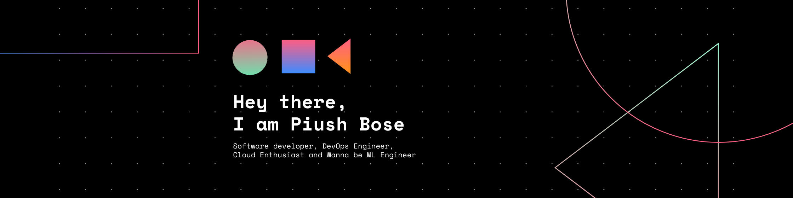

# 🏄‍♂️ Piush Bose

**Full stack developer | DevOps Engineee | Cloud Engineer** 

<!--    -->

 
😉 I am an "Indie DevOps engineer, aiming to get better and better at his current skillsets, and expand their interests into more cloudy ☁️ things (I mean more to the cloud and operations)"

💻 Check out
[My Resume](https://drive.google.com/file/d/1nD-YVnfBAauu5Sa3LMn8PzM_AOrXl6SE/view?usp=sharing)

##    

### 🧰 Languages and Tools

 

 

 

---
### 📊 Stats

 
 

<!-- 

   
   

 -->
---

 

  

